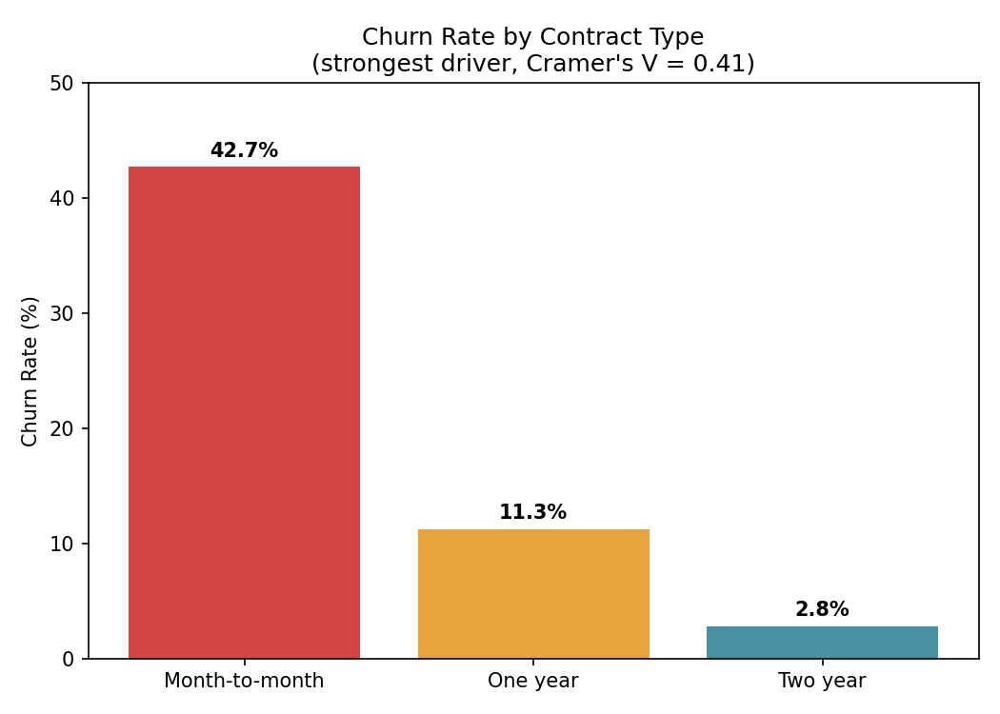

# Telco Customer Churn: Statistical Driver Analysis

## Overview

Losing a customer costs a lot more than most businesses like to admit, acquiring a new one almost always costs more than keeping an existing one happy. Yet a lot of churn analysis stops at "these variables correlate with churn" without asking the harder question: *which of these actually matter enough to act on?*

That's the gap this project tries to close. Using a telecom operator's customer base of 7,043 subscribers, I combined statistical hypothesis testing with a Power BI dashboard to separate genuine churn drivers from statistical noise, then turned that into a set of concrete, defensible business recommendations, not just a list of "significant" p-values.

## The Problem

Telecom is a brutal industry for retention, customers can switch providers with a phone call, and once they're gone, the acquisition cost to replace them is steep. This operator has a 26.5% churn rate, and I was asked, in effect, the question every retention team eventually gets asked: *"where should we actually focus, and why?"*

That question breaks down into three parts:

1. Which customer and account characteristics are statistically associated with churn?
2. Of those, which ones matter enough in practice to justify spending a retention budget on, versus which are technically "significant" but barely move the needle?
3. Given the answer, what should the business actually do?

That third question is the one a lot of churn projects skip, and it's the one I cared about most here, a chart showing "fiber optic customers churn more" isn't useful on its own; a recommendation is.

## Dataset

**Source:** [IBM Telco Customer Churn dataset (Kaggle)](https://www.kaggle.com/datasets/blastchar/telco-customer-churn)

- 7,043 customer records, 21 attributes spanning demographics, subscribed services, contract terms, and billing
- Overall churn rate: 26.5%

## How I Approached It

**1. Data cleaning.** The `TotalCharges` column looked numeric but was stored as text, and 11 rows were just blank. Rather than dropping them, I checked *why* every single one belonged to a brand-new customer with `tenure = 0` who simply hadn't been billed yet. That's a real-world data quality pattern, not random noise, so I filled those with 0 instead of discarding data.

I also collapsed categories like `"No internet service"` down to `"No"` across six columns. Small thing, but it matters leaving it as a separate category would have quietly distorted the chi-square tests later.

**2. Hypothesis testing.** For categorical variables (contract type, payment method, etc.) I used chi-square tests of independence against churn. For numeric variables (tenure, monthly charges) I used Welch's t-test, which doesn't assume equal variance between the churned and retained groups, a safer default than a standard t-test when you haven't verified that assumption.

**3. Effect size the part that actually matters.** Here's the catch with a dataset this size: with over 7,000 rows, almost *any* variable comes back "statistically significant" at p < 0.05, even ones with a trivial real-world effect. So statistical significance alone isn't a good filter for where to focus. I calculated Cramer's V for every categorical variable to measure the actual *strength* of association, not just whether one exists. This is what let me separate the handful of drivers worth acting on from the long list of technically significant but practically irrelevant ones.

**4. Visualization.** Static charts in Matplotlib for the analysis itself, plus a Power BI dashboard so the findings are explorable by someone who isn't going to read a Jupyter notebook.

## Key Findings

**Contract type is, by a wide margin, the strongest driver of churn** (Cramer's V = 0.41 , moderate-to-strong, and the highest of any variable tested). The pattern is stark once you lay it out:

- Month-to-month contracts: **42.7% churn**
- One-year contracts: **11.3% churn**
- Two-year contracts: **2.8% churn**

That's not a subtle difference a month-to-month customer is roughly 15x more likely to churn than a two year customer. If I had to point to one lever for this business to pull first, it's this one.

**Internet service type and payment method are the next-strongest signals** (Cramer's V = 0.32 and 0.30). Specifically, customers on fiber optic internet who pay via electronic check churn noticeably more than other combinations. That's an interesting one because it's not immediately obvious *why* it could be pricing, service quality, or friction in the electronic check billing experience and it's the kind of finding that warrants a follow up conversation with the business rather than a definitive answer from the data alone.

**Tenure and spend tell a consistent story.** Customers who churned had been with the company for an average of 18 months and paid $74.44/month, compared to 37.6 months and $61.27/month for customers who stayed. Put simply: the customers walking away tend to be newer and paying more which, combined with the contract finding, points toward weak early lifecycle retention rather than long-term customers suddenly deciding to leave.

**Just as important what turned out *not* to matter.** Gender, phone service, streaming TV, streaming movies, and multiple lines were either not statistically significant or had negligible effect sizes despite sometimes "looking" different in a raw crosstab. If this were a real retention budget, I'd actively recommend *not* spending it chasing these a genuinely useful finding, even though it's a negative one.

## Business Recommendations

1. **Make it easier and more attractive to move off month-to-month contracts.** This is the single highest-leverage lever in the data targeted discounts or perks for upgrading to a one- or two-year term directly address the strongest churn driver found.
2. **Dig into the fiber optic + electronic check segment specifically.** The data flags this combination as a risk pocket, but the *why* needs a human follow up a service quality audit or a look at billing friction in that payment flow.
3. **Shift retention effort earlier in the customer lifecycle.** Since churned customers skew toward the first ~18 months, onboarding and early check-ins likely offer more ROI than long-tenure loyalty perks.

# Power BI Dashboard

The statistical analysis was complemented with an interactive Power BI dashboard for business users.

**Dashboard Preview**


The dashboard includes:

- Overall customer KPIs
- Churn rate by contract type
- Internet Service vs Payment Method heatmap
- Customer distribution by tenure
- Tenure vs Monthly Charges scatter plot
- Interactive slicers for Contract, Internet Service, and Senior Citizen status

---

# Sample Visualization

<p align="center">
  
</p>

---

# Project Structure

```text
telco-churn-analysis/
│
├── data/
│   ├── telco_churn_raw.csv
│   └── telco_churn_clean.csv
│
├── notebooks/
│   ├── 01_data_cleaning.py
│   ├── 02_eda_statistical_tests.py
│   ├── 03_effect_sizes.py
│   └── 04_visualization.py
│
├── outputs/
│   ├── chi_square_results.csv
│   ├── ttest_results.csv
│   ├── effect_sizes.csv
│   ├── churn_by_contract.png
│   └── power_bi_dashboard.png
│
├── Dashboard_telco-churn-analysis.pbix
│
└── README.md
```

---

# Technologies Used

- Python
- Pandas
- NumPy
- SciPy
- Matplotlib
- Power BI
- DAX
- Power Query

---

What This Project Shows

More than anything, this project is an argument for not stopping at "the p-value is small." A dataset this size will hand you a dozen "significant" variables whether or not they're useful the actual analytical work is in figuring out which of those are worth a business acting on, and being honest about the ones that aren't.
---
